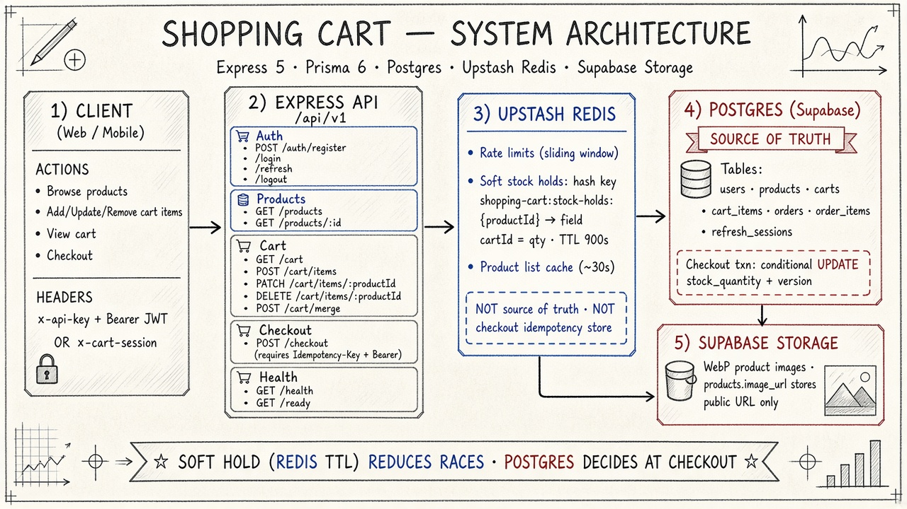
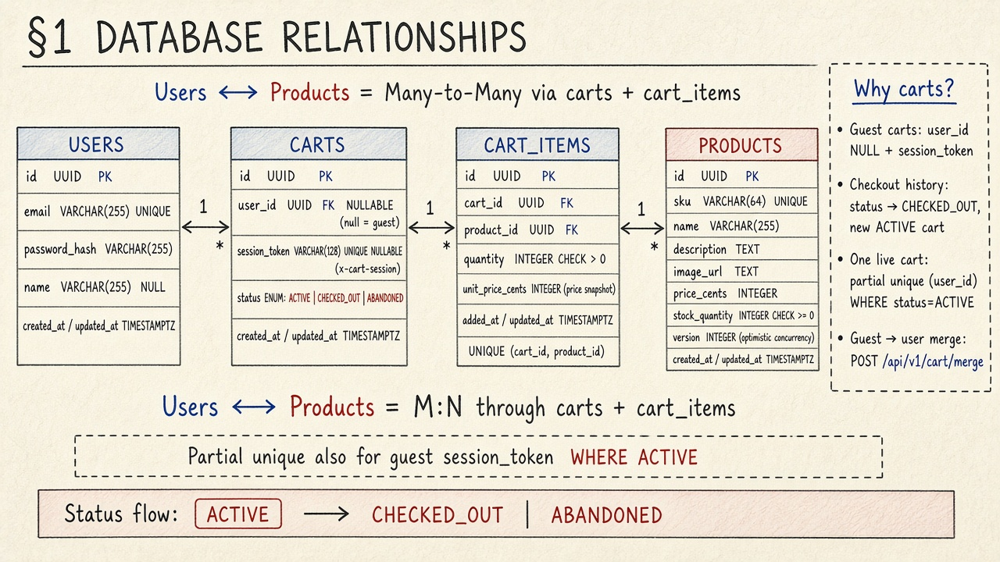
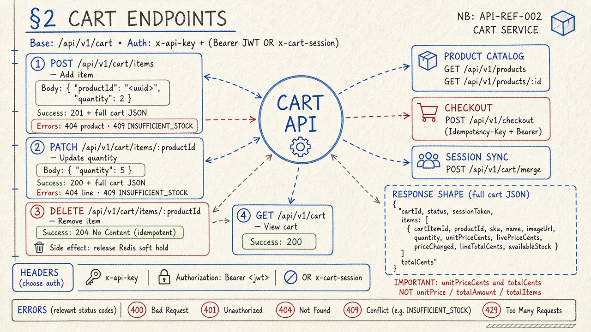
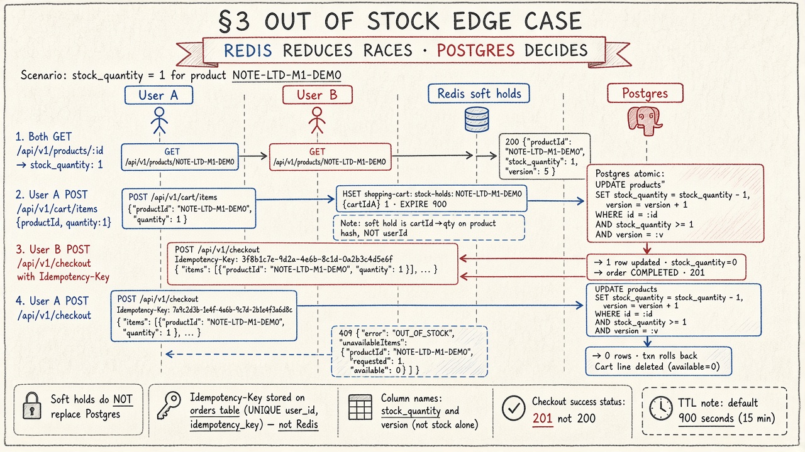
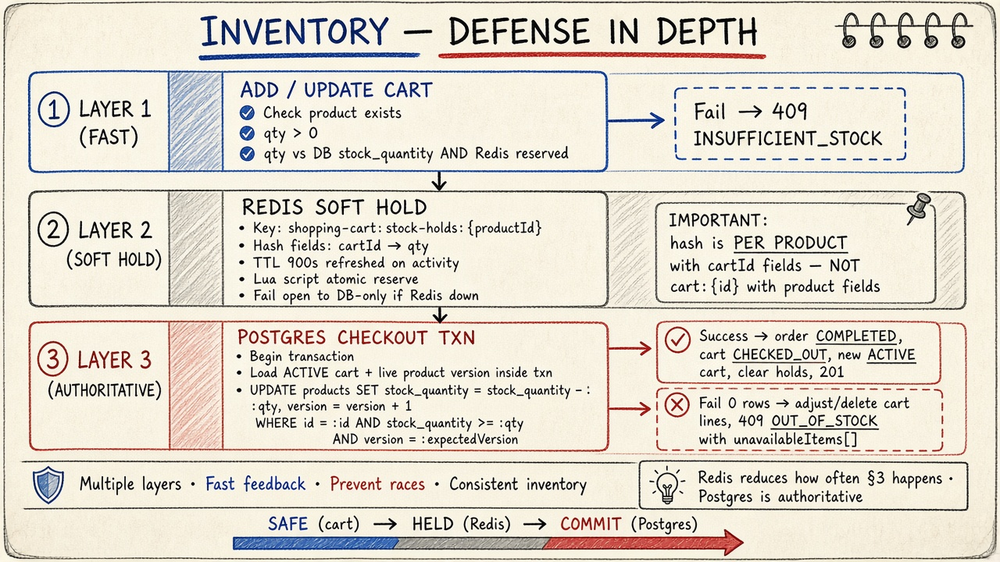

# Shopping Cart — Design Document

**Written answers to the three assignment sections are below.**  
Deeper implementation notes follow after that.

| | |
|--|--|
| **Live API docs** | [https://storefront-awbc.onrender.com/api-docs#/](https://storefront-awbc.onrender.com/api-docs#/) |
| **Health / ready** | [https://storefront-awbc.onrender.com/ready](https://storefront-awbc.onrender.com/ready) |
| **Local OpenAPI** | `http://localhost:3002/api-docs` |
| **Stack** | Express 5 · Prisma 6 · PostgreSQL · Upstash Redis · Supabase Storage |



*Client → Express API → Redis (rate limits, soft stock holds, short cache) → Postgres as source of truth → product images in storage. Soft hold while shopping; checkout commits in Postgres.*

---

# Assignment answers (written design)

## 1. Database Relationships

We use a relational (SQL) schema. The brief names **Users**, **Products**, and **Cart Items**. Those three alone imply a **Many-to-Many** between users and products (many shoppers can hold the same SKU; one shopper can hold many SKUs). The join table is cart lines.

In practice we add a **`carts`** table between the user and the lines. That is still the same Many-to-Many — carts are the lifecycle boundary (guest cart, checkout history, one live cart per user). Without carts, guest shopping and “old cart vs new cart after pay” get messy.



*Users 1→N Carts 1→N Cart Items N←1 Products. One ACTIVE cart per user (or guest session). After checkout the cart becomes CHECKED_OUT and a new ACTIVE cart is opened.*

### Tables, columns, and types

#### `users`

| Column | Type | Notes |
|--------|------|--------|
| `id` | `UUID` | Primary key |
| `email` | `VARCHAR(255)` | Unique, required |
| `password_hash` | `VARCHAR(255)` | bcrypt |
| `name` | `VARCHAR(255)` | Optional |
| `created_at` / `updated_at` | `TIMESTAMPTZ` | |

#### `products`

| Column | Type | Notes |
|--------|------|--------|
| `id` | `UUID` | Primary key |
| `sku` | `VARCHAR(64)` | Unique |
| `name` | `VARCHAR(255)` | |
| `description` | `TEXT` | Optional |
| `image_url` | `TEXT` | Optional |
| `price_cents` | `INTEGER` | Money as integer cents |
| `stock_quantity` | `INTEGER` | `CHECK >= 0` |
| `version` | `INTEGER` | Optimistic lock at checkout |
| `created_at` / `updated_at` | `TIMESTAMPTZ` | |

#### `carts` (lifecycle wrapper around cart items)

| Column | Type | Notes |
|--------|------|--------|
| `id` | `UUID` | Primary key |
| `user_id` | `UUID` FK → `users` | **NULL for guests** |
| `session_token` | `VARCHAR(128)` | Guest identity (`x-cart-session`) |
| `status` | `ENUM` | `ACTIVE` \| `CHECKED_OUT` \| `ABANDONED` |
| `created_at` / `updated_at` | `TIMESTAMPTZ` | |

#### `cart_items`

| Column | Type | Notes |
|--------|------|--------|
| `id` | `UUID` | Primary key |
| `cart_id` | `UUID` FK → `carts` | |
| `product_id` | `UUID` FK → `products` | |
| `quantity` | `INTEGER` | `CHECK > 0` |
| `unit_price_cents` | `INTEGER` | Price **snapshot** when added |
| | | **UNIQUE (`cart_id`, `product_id`)** |

### Relationships (assignment vocabulary)

| Pair | Cardinality | How |
|------|-------------|-----|
| **User ↔ Product** | **Many-to-Many** | Through `carts` + `cart_items` |
| **User → Cart Item** | **One-to-Many** (indirect) | User → Cart → Cart Items |
| **Product → Cart Item** | **One-to-Many** | Many lines can reference one product |
| User → Cart | One-to-Many | At most one `ACTIVE` cart at a time |
| Cart → Cart Item | One-to-Many | Lines belong to exactly one cart |

There is **no One-to-One** between Users and Products. Money is stored as cents; `unit_price_cents` freezes the price on the line so a catalog change does not silently rewrite an open cart.

---

## 2. API Endpoints

Cart writes need `x-api-key`, plus either a logged-in `Authorization: Bearer <access JWT>` or a guest `x-cart-session`. Full interactive docs (try the routes live):

**[https://storefront-awbc.onrender.com/api-docs#/](https://storefront-awbc.onrender.com/api-docs#/)**



*`GET /cart` · `POST` / `PATCH` / `DELETE` on `/cart/items` · common errors 400 / 401 / 404 / 409 / 429.*

### Required cart mutations

#### Add an item to the cart

| | |
|--|--|
| **HTTP method** | `POST` |
| **Route** | `/api/v1/cart/items` |
| **Body parameters** | `{ "productId": "<uuid>", "quantity": 2 }` |
| **Success** | `201` + full cart JSON |
| **Errors** | `404` product missing · `409 INSUFFICIENT_STOCK` |

Upserts by `(cart_id, product_id)`, snapshots `unit_price_cents`, and places a short-lived soft hold in Redis so flash-sale units are not over-promised across carts.

#### Update the quantity of an item in the cart

| | |
|--|--|
| **HTTP method** | `PATCH` |
| **Route** | `/api/v1/cart/items/:productId` |
| **Path parameter** | `productId` (product UUID) |
| **Body parameters** | `{ "quantity": 5 }` |
| **Success** | `200` + full cart JSON |
| **Errors** | `404` line missing · `409 INSUFFICIENT_STOCK` |

#### Remove an item from the cart

| | |
|--|--|
| **HTTP method** | `DELETE` |
| **Route** | `/api/v1/cart/items/:productId` |
| **Path parameter** | `productId` |
| **Body** | none |
| **Success** | `204 No Content` (safe if already gone) |

Also part of the objective flow (browse / view / pay):

| Goal | Method | Route | Parameters |
|------|--------|-------|------------|
| Browse | `GET` | `/api/v1/products` | — |
| View cart | `GET` | `/api/v1/cart` | headers only |
| Checkout | `POST` | `/api/v1/checkout` | header **`Idempotency-Key`** (required) + Bearer |

---

## 3. The “Out of Stock” Edge Case

**Scenario:** User A already has the last unit in their cart. Right before A hits Checkout, User B buys that last unit. A then checks out.

**Principle:** Never silently succeed or oversell. Prefer a clear conflict the client can show in the UI. **Postgres is the source of truth at payment time.** Redis soft holds only reduce how often this race happens; they do not replace the checkout check.



*A soft-holds the last unit → B’s checkout commits in Postgres → A gets `409 OUT_OF_STOCK`. Motto: Redis reduces races · Postgres decides.*

### Defense in depth



*Layer 1: early `409 INSUFFICIENT_STOCK` on add/update · Layer 2: Redis soft hold (TTL) · Layer 3: Postgres checkout transaction. Fast feedback, fewer races, consistent inventory.*

### What the system does when A checks out after B

1. If `(userId, Idempotency-Key)` already has an order → return that order (safe retry / double-click).
2. Open a **database transaction**. Load A’s ACTIVE cart and **live** product `stock_quantity` + `version` inside the transaction.
3. For each cart line, attempt an atomic decrement:

```sql
UPDATE products
SET stock_quantity = stock_quantity - :qty,
    version        = version + 1,
    updated_at     = NOW()
WHERE id = :id::uuid
  AND stock_quantity >= :qty
  AND version = :expectedVersion;
```

4. **If any update returns 0 rows** (B already took the unit, or version moved):
   - Roll back the order (no charge, no partial sell).
   - Adjust A’s cart: set quantity to what is left, or **delete** the line if `available = 0`.
   - Respond **`409 Conflict`**:

```json
{
  "statusCode": 409,
  "error": "OUT_OF_STOCK",
  "message": "Some items in your cart are no longer available.",
  "unavailableItems": [
    {
      "productId": "…",
      "name": "Limited Edition M1 Demo Unit",
      "requested": 1,
      "available": 0
    }
  ]
}
```

5. **If every line succeeds:** create the order (`PENDING` → `COMPLETED`), mark the cart `CHECKED_OUT`, open a new `ACTIVE` cart, clear Redis holds for that cart, return `201`.

That is seamless for the product: no money taken for missing stock, a structured error the UI can render, a cart left in a usable state, and idempotent retries so Pay is not double-applied.

---

# Detailed design (implementation reference)

The sections below expand the same three answers with schema detail, supporting endpoints, and production notes.

## 1. Database Relationships (detail)

### Design choice (why not `cart_items.user_id` alone?)

The prompt names **Users**, **Products**, and **Cart Items**. A naive schema hangs `cart_items` directly on `users` (M:N via join). We insert an intermediate **`carts`** table because:

| Need | Without `carts` | With `carts` |
|------|-----------------|--------------|
| Guest shopping | Awkward / impossible cleanly | `user_id` NULL + `session_token` |
| Checkout history | Lose cart identity at pay | Cart → `CHECKED_OUT`, new `ACTIVE` cart |
| One live cart | App-enforced only | Partial unique index on `(user_id) WHERE status = 'ACTIVE'` |
| Merge guest → user | Hard | Explicit `POST /cart/merge` |

So: **Users ↔ Products is still Many-to-Many**, resolved through **`carts` + `cart_items`**.


*Users 1→N Carts 1→N Cart Items N←1 Products. Partial unique index: one ACTIVE cart per user. Cart status: ACTIVE → CHECKED_OUT | ABANDONED.*

### Entity relationship diagram

```
┌──────────┐         ┌──────────┐         ┌────────────┐         ┌──────────┐
│  users   │ 1     * │  carts   │ 1     * │ cart_items │ *     1 │ products │
│          │─────────│          │─────────│            │─────────│          │
└──────────┘         └──────────┘         └────────────┘         └──────────┘
     │ 1                    │ 1
     │                      │
     │ *                    │ *
┌──────────┐         ┌────────────┐         ┌──────────┐
│  orders  │─────────│ order_items│─────────│ products │
└──────────┘ 1     * └────────────┘ *     1 └──────────┘
```

### Tables (assignment core)

#### `users`

| Column | Type | Constraints |
|--------|------|-------------|
| `id` | `UUID` | PK, default `gen_random_uuid()` |
| `email` | `VARCHAR(255)` | UNIQUE, NOT NULL |
| `password_hash` | `VARCHAR(255)` | NOT NULL (bcrypt) |
| `name` | `VARCHAR(255)` | NULL |
| `created_at` | `TIMESTAMPTZ` | NOT NULL, default `now()` |
| `updated_at` | `TIMESTAMPTZ` | NOT NULL |

#### `products`

| Column | Type | Constraints |
|--------|------|-------------|
| `id` | `UUID` | PK |
| `sku` | `VARCHAR(64)` | UNIQUE, NOT NULL |
| `name` | `VARCHAR(255)` | NOT NULL |
| `description` | `TEXT` | NULL |
| `image_url` | `TEXT` | NULL — public object URL (Supabase Storage WebP) |
| `price_cents` | `INTEGER` | NOT NULL |
| `stock_quantity` | `INTEGER` | NOT NULL, **CHECK `>= 0`** |
| `version` | `INTEGER` | NOT NULL, default `0` — optimistic concurrency |
| `created_at` / `updated_at` | `TIMESTAMPTZ` | |

#### `carts`

| Column | Type | Constraints |
|--------|------|-------------|
| `id` | `UUID` | PK |
| `user_id` | `UUID` | FK → `users.id` ON DELETE CASCADE, **NULL for guests** |
| `session_token` | `VARCHAR(128)` | UNIQUE, NULL — `x-cart-session` header |
| `status` | `ENUM` | `ACTIVE` \| `CHECKED_OUT` \| `ABANDONED`, default `ACTIVE` |
| `created_at` / `updated_at` | `TIMESTAMPTZ` | |

Partial unique indexes (SQL migration; Prisma cannot express these):

- One **ACTIVE** cart per logged-in user  
- One **ACTIVE** cart per guest `session_token`

#### `cart_items`

| Column | Type | Constraints |
|--------|------|-------------|
| `id` | `UUID` | PK |
| `cart_id` | `UUID` | FK → `carts.id` ON DELETE CASCADE |
| `product_id` | `UUID` | FK → `products.id` ON DELETE RESTRICT |
| `quantity` | `INTEGER` | NOT NULL, **CHECK `> 0`** |
| `unit_price_cents` | `INTEGER` | NOT NULL — **price snapshot** at add/update |
| `added_at` / `updated_at` | `TIMESTAMPTZ` | |
| | | **UNIQUE (`cart_id`, `product_id`)** — one line per product per cart |

### Relationship summary (prompt vocabulary)

| Entities | Cardinality | Mechanism |
|----------|-------------|-----------|
| **User → Cart Item** | One-to-Many (indirect) | User → Cart → CartItem |
| **Product → Cart Item** | One-to-Many | `cart_items.product_id` |
| **User ↔ Product** | **Many-to-Many** | Through `carts` + `cart_items` |
| User → Cart | One-to-Many | At most one `ACTIVE` at a time |
| Cart → Cart Item | One-to-Many | Lines belong to exactly one cart |

### Supporting tables (checkout / auth — not named in §1 but required to “handle checking out”)

| Table | Role |
|-------|------|
| `orders` | Checkout result; `UNIQUE (user_id, idempotency_key)`; status `PENDING` → `COMPLETED` / `CANCELLED` |
| `order_items` | Immutable line snapshots (`quantity`, `unit_price_cents`) |
| `refresh_sessions` | Hashed refresh tokens; rotation + reuse detection |

---

## 2. API Endpoints (detail)

**Auth model**

| Concern | Mechanism |
|---------|-----------|
| Identity | `Authorization: Bearer <access JWT>` (15m) **or** guest `x-cart-session` |
| Cart / checkout gate | `x-api-key` required |
| Refresh | Opaque token, SHA-256 in DB, rotates on `/auth/refresh` |


*`GET /cart` · `POST/PATCH/DELETE /cart/items` · headers: `x-api-key` + Bearer **or** `x-cart-session` · common errors 400 / 401 / 404 / 409 / 429.*

### Prompt-required cart mutations

#### Add an item to the cart

| | |
|--|--|
| **Method** | `POST` |
| **Route** | `/api/v1/cart/items` |
| **Headers** | `x-api-key`, plus `Authorization` **or** `x-cart-session` |
| **Body** | `{ "productId": "<uuid>", "quantity": 2 }` |
| **Success** | `201` + full cart JSON |
| **Errors** | `404` product missing · `409 INSUFFICIENT_STOCK` (DB stock and/or Redis soft hold) |

Behavior: upsert by `(cart_id, product_id)`; snapshot `unit_price_cents`; reserve qty in Redis (TTL, default 15m).

#### Update the quantity of an item

| | |
|--|--|
| **Method** | `PATCH` |
| **Route** | `/api/v1/cart/items/:productId` |
| **Headers** | same as add |
| **Path** | `productId` — product UUID (not cart-line id) |
| **Body** | `{ "quantity": 5 }` |
| **Success** | `200` + full cart JSON |
| **Errors** | `404` line missing · `409 INSUFFICIENT_STOCK` |

#### Remove an item from the cart

| | |
|--|--|
| **Method** | `DELETE` |
| **Route** | `/api/v1/cart/items/:productId` |
| **Headers** | same as add |
| **Path** | `productId` |
| **Success** | `204 No Content` (idempotent if already absent) |
| **Side effect** | Releases Redis soft hold for that product on this cart |

### Also required by the objective wording

| Goal | Method | Route | Parameters |
|------|--------|-------|------------|
| Browse catalog | `GET` | `/api/v1/products` | — (list cached ~30s in Redis) |
| Browse one item | `GET` | `/api/v1/products/:id` | path: product UUID |
| View current cart | `GET` | `/api/v1/cart` | headers: api-key + auth or session |
| Check out | `POST` | `/api/v1/checkout` | headers: api-key, Bearer, **`Idempotency-Key`** (required) |

#### Checkout detail

| | |
|--|--|
| **Success** | `201` — order with `status: "COMPLETED"`, line items, `totalCents` |
| **Idempotent replay** | Same `Idempotency-Key` → same order, no double stock decrement |
| **Stock race** | `409` — see §3 |
| **Missing key** | `400` |

### Supporting endpoints (run the system)

| Method | Route | Purpose |
|--------|-------|---------|
| `POST` | `/api/v1/auth/register` | `{ email, password }` → token pair |
| `POST` | `/api/v1/auth/login` | `{ email, password }` → token pair |
| `POST` | `/api/v1/auth/refresh` | `{ refreshToken }` → rotated pair |
| `POST` | `/api/v1/auth/logout` | Revoke refresh |
| `POST` | `/api/v1/cart/merge` | Guest `x-cart-session` → user cart after login |
| `GET` | `/health` · `/ready` | Liveness; readiness includes DB + Redis |

---

## 3. The “Out of Stock” Edge Case (detail)

### Scenario

> User A has the last unit of a product in their cart. User B checks out first and buys it. User A then hits **Checkout**.

### Principle

**Never silently succeed.** Prefer a clear conflict the client can turn into UI (“Only 0 left — update your cart”) over selling inventory you do not have.  
**Postgres is the source of truth at payment time.** Redis soft holds reduce how often this race happens; they do not replace the transactional check.


*User A soft-holds last unit → User B checkout commits in Postgres → User A gets `409 OUT_OF_STOCK`. Motto: Redis reduces races · Postgres decides.*

### Defense in depth


*Layer 1: cart API early `409 INSUFFICIENT_STOCK` · Layer 2: Redis soft hold (TTL) · Layer 3: Postgres checkout txn (atomic UPDATE). Motto: multiple layers · fast feedback · prevent races · consistent inventory.*

```
┌─────────────────┐     ┌──────────────────────┐     ┌─────────────────────────────┐
│ Add / update    │     │ Soft hold (Redis)    │     │ Checkout (Postgres txn)     │
│ cart line       │────▶│ TTL reservation      │────▶│ Conditional stock UPDATE    │
│                 │     │ across all carts     │     │ + order create or 409       │
└─────────────────┘     └──────────────────────┘     └─────────────────────────────┘
        early reject              flash-sale aid              authoritative decision
```

1. **Add/update cart** — reject if `qty > stock` or Redis says other carts already reserved the units (`409 INSUFFICIENT_STOCK`).
2. **Redis soft hold** — hash per product (`cartId → qty`), TTL refreshed on activity (default **900s**). Idle carts auto-release inventory.
3. **Checkout (authoritative)** — inside a DB transaction:

### Checkout algorithm (what runs when A pays after B)

1. Fast-path: if `(userId, idempotencyKey)` already has an order → return it (safe retry).
2. Open a transaction; re-check idempotency.
3. Load the user’s **ACTIVE** cart **and** live `products.version` / `stock_quantity` **inside** the transaction (no stale pre-txn snapshot).
4. For each line, attempt an atomic decrement:

```sql
UPDATE products
SET stock_quantity = stock_quantity - :qty,
    version        = version + 1,
    updated_at     = NOW()
WHERE id = :id::uuid
  AND stock_quantity >= :qty
  AND version = :expectedVersion;
```

5. **If any update returns 0 rows** (B already took the last unit, or a concurrent checkout bumped `version`):
   - Abort order creation (transaction rolls back stock changes).
   - Adjust A’s cart: set line qty to `available`, or **delete** the line if `available = 0`.
   - Release is unnecessary for sold-out lines after adjust; remaining holds stay coherent with cart.
   - Return **`409 Conflict`**:

```json
{
  "statusCode": 409,
  "error": "OUT_OF_STOCK",
  "message": "Some items in your cart are no longer available.",
  "unavailableItems": [
    {
      "productId": "…",
      "name": "Limited Edition M1 Demo Unit",
      "requested": 1,
      "available": 0
    }
  ],
  "requestId": "…"
}
```

6. **If all lines succeed:**
   - Create order `PENDING` → flip to `COMPLETED` (sync checkout; payment hook would sit between these states).
   - Mark cart `CHECKED_OUT`; create a fresh `ACTIVE` cart.
   - Clear Redis soft holds for that cart.
   - Return `201` with the order.

7. Client retries with the **same** `Idempotency-Key` get the **same** order — no double charge / double decrement.

### Why this is seamless for the product

| Client need | System behavior |
|-------------|-----------------|
| Don’t take money for missing stock | No order row committed on conflict |
| Tell the user what failed | Structured `unavailableItems[]` |
| Leave cart usable | Quantities auto-clamped / removed |
| Safe “Pay” double-click | Idempotency key |
| Reduce how often §3 happens | Redis holds + early `INSUFFICIENT_STOCK` |

Demo SKU for manual race tests: `NOTE-LTD-M1-DEMO` (stock = 1).

---

## Production extensions (beyond the three sections)

Built to strengthen the same design under real load — not required by the written prompt:

| Area | Implementation |
|------|----------------|
| Images | Supabase Storage (S3); resized WebP via `npm run storage:sync-images:force` |
| Rate limits | Upstash sliding windows (global + write), shared across instances |
| Catalog cache | Redis ~30s list cache; invalidated on checkout/seed |
| Soft stock holds | Redis hash + Lua; Postgres still wins at checkout |
| Auth hardening | Refresh rotation; reuse of a rotated token revokes the session family |
| Observability | Request IDs, Pino logs, `/ready` checks DB + Redis |
| Contract | Zod → OpenAPI → Stoplight at `/api-docs` |
| Quality | E2E suite covering auth → guest merge → checkout → idempotency |

**Intentionally deferred:** external payment capture, `GET /orders` history API, guest-cart TTL sweeper, read replicas.

---

## Interview talking points

Use these three answers when a reviewer asks *why* — not just *what*.

### 1. Why does a `carts` table exist?

The prompt only names Users, Products, and Cart Items. Hanging `cart_items.user_id` works for a toy model, but breaks real flows:

| Requirement | With `carts` |
|-------------|----------------|
| **Guests** | `user_id` NULL + `session_token` (`x-cart-session`); no fake user row |
| **History** | Checkout flips cart → `CHECKED_OUT`; user gets a new `ACTIVE` cart — past lines stay queryable via the old cart / order |
| **One live cart** | Partial unique index `(user_id) WHERE status = 'ACTIVE'` (and same for guest `session_token`) |
| **Login merge** | Explicit `POST /api/v1/cart/merge` moves guest lines into the user’s ACTIVE cart |

**Soundbite:** *“Users ↔ Products is still M:N; `carts` is the lifecycle boundary for guest → active → checked-out.”*

### 2. Why does Postgres decide at checkout?

Cart add/update and Redis holds are **optimistic UX**. Money and inventory commit only inside a Postgres transaction:

```sql
UPDATE products
SET stock_quantity = stock_quantity - :qty,
    version        = version + 1
WHERE id = :id
  AND stock_quantity >= :qty
  AND version = :expectedVersion;
```

- **0 rows** → another checkout already won (or version moved) → roll back, clamp/delete the line, return **`409 OUT_OF_STOCK`** with `unavailableItems[]`.
- **Never** trust Redis or a pre-txn stock read as final.
- **Idempotency** lives on `orders (user_id, idempotency_key)` so double-click “Pay” returns the same order, not a second decrement.

**Soundbite:** *“Redis reduces how often the race happens; Postgres is the only place we sell stock.”*

### 3. What do Redis soft holds do?

Soft holds are a **flash-sale aid**, not a second inventory database.

| Detail | Implementation |
|--------|----------------|
| Key | `shopping-cart:stock-holds:{productId}` — one hash **per product** |
| Fields | `cartId → qty` |
| TTL | Default **900s**, refreshed on cart activity; idle carts auto-release |
| On add/update | Lua reserve; fail → `409 INSUFFICIENT_STOCK` before writing the line |
| On delete / checkout success | Release that cart’s fields |
| Redis down | Fail open → DB-only stock check (checkout still authoritative) |

**Soundbite:** *“Holds stop ten carts from each ‘reserving’ the last unit in the UI; they never replace the conditional `UPDATE` at pay time.”*

### 60-second oral walkthrough

1. Schema: Users 1→N Carts 1→N Cart Items N←1 Products; price snapshot on `unit_price_cents`; `version` on products.  
2. APIs: `POST/PATCH/DELETE /api/v1/cart/items` (+ browse, `GET /cart`, `POST /checkout` with `Idempotency-Key`).  
3. Race: A soft-holds last unit → B checkouts first → A gets `409`, cart cleaned — no silent oversell.

---

## Assignment checklist

| Objective | Delivered |
|-----------|-----------|
| §1 SQL schema + relationships for Users / Products / Cart Items | Yes (+ `carts` justified) |
| §2 Add / update / remove endpoints with methods, routes, params | Yes |
| Browse + view cart + checkout (objective intro) | Yes |
| §3 Last-unit race handled seamlessly | Yes — txn + `409` + cart adjust + idempotency |

**Demo login:** `demo@shop.local` / `demo1234`
